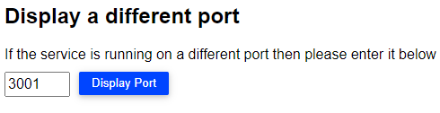

## Bu bölümde, Merhaba Dünya uygulamasının Service'ini oluşturup Dış dünyaya erişimie açacağız.


Merhaba Dünya uygulamasını dış dünayaya erişime açma işlemi için aşağıda ki adımları takip edeceğiz.

1.Bu bölümde kullanılmak üzere farklı bir Deployment belgesini kullanarak merhaba-dunya uyglamasını çalıştıracağız.

2.Merhaba-dunya uygulaması için elle port-forward ederek trafiğin erişmesini sağlayacağız.

3.Merhaba-dunya uygulamasının pod sayısının scale ederek birden fazla pod oluşturacağız.

4.Merhaba-dunya uygulamamız için önce elle bir servis oluşturacağız, sonrasında bu bu servisi imha edip yerine yaml belgesi ile servisi tekrar oluşturacağız.

Pod'larımızı, **"04-Merhaba-dunya-Deployment1.yml"** adında ki belgemizi kullanarak kuberenetes'de çalıştıralım.

`kubectl apply -f 04-Merhaba-dunya-Deployment1.yml`{{execute T1}}

Bu deployment daha öncekinden farklı olarak, replica sayısını bir adet olarak tanımlanmış şekilde çalıştırmaktadır.

```
deployment.apps/merhaba-dunya-deploy created
```

Oluşan deployment'i kontrol için ***kubectl get deployment*** komutunu kullanarak görüntüleyebiliriz.

`kubectl get deployment merhaba-dunya-deploy`{{execute T1}}

```
NAME                   READY   UP-TO-DATE   AVAILABLE   AGE
merhaba-dunya-deploy   1/1     1            1           68s
```

Deployment'imiz çalışıyor, bu deployment'da çalışan podların hangi node'larda çalıştıkları ve hangi IP adreslerine sahip oldukları bilgisine erişmek istediğimizde ***kubectl get pods -o wide*** komutunu kullanarak görüntüleyebiliriz.

`kubectl get pods -o wide`{{execute T1}}

Deployment'in detayını görüntülemek için ***kubectl get deployment -o wide*** komutunu kullanrak görüntüleyebiliriz.

`kubectl get deployment -o wide`{{execute T1}}

```
NAME                   READY   UP-TO-DATE   AVAILABLE   AGE     CONTAINERS      IMAGES                       SELECTOR
merhaba-dunya-deploy   3/3     3            3           5m55s   merhaba-dunya   techakademi/merhabadunya:1   name=Merhaba-dunya
```

Tekil çalışan pod'umuza trafiği ulaştırmak için kubectl port-forward komutunu kullanarak dış dünyanın erişimine açalım.

Port-forward komutunda, --address opsiyonunu kullanarak tüm adreslerde 3001 portunu dinleyerek, 3000 portuna iletmesini istiyoruz. Eğer --address opsiyonunun kullanmaz isek, uygulama yalnızca yerel olarak erişilebilir olur.


```
kubectl port-forward merhaba-dunya-deploy-<deployment-ID> --address 0.0.0.0 3001:3000
```

Port forward işlemi gerçekleşince, terminal ekranı 3001 portunu dinlemeye başlayacaktır.

```
Forwarding from 0.0.0.0:3001 -> 80
```

---
### Merhaba Dünya uygulamamızı aşağıdaki link  üzerinden kontrol edebiliriz:

https://[[HOST_SUBDOMAIN]]-80-[[KATACODA_HOST]].environments.katacoda.com

---

Uygulama çalışmaya devam ederken, loglarını kontrol edebiliriz. Kubernetes'de loglara erişebilmek için kubectl logs <pod-adı> belirterek gözlemleyebiliriz. Zaman zaman pod'lar çalışır durumda olur ancak uygulamaya erişilemeyebilir, bunun nedenini bulmak isteriz, böylesi durumlarda ilk bakılacak yer her zaman loglardır, loglar uygulamaların aynalarıdır :).


Yeni bir terminal açıp, Deployment'un loglarını inceleyelim.

1.Adım Terminal açıp logları inceleyelim.

`"Yeni terminal aç"`{{execute T2}}

2.Merhaba Dunya Deployment'in logunu inceleyelim:

Log gözlemleme komutunu elle yazmalıyız.

```
kubectl logs merhaba-dunya-deploy-<Deployment'in ID'si>
```

Komutun çıktısı aşağıdaki gibi görünecektir:
```
127.0.0.1 - - [30/Dec/2021:11:38:09 +0000] "GET /style.css HTTP/1.1" 304 0 "http://192.168.1.73:3001/" "Mozilla/5.0 (Windows NT 10.0; Win64; x64; rv:95.0) Gecko/20100101 Firefox/95.0"
127.0.0.1 - - [30/Dec/2021:11:38:09 +0000] "GET /script.js HTTP/1.1" 304 0 "http://192.168.1.73:3001/" "Mozilla/5.0 (Windows NT 10.0; Win64; x64; rv:95.0) Gecko/20100101 Firefox/95.0"
```
Loglama bölümünü burada tamamlayıp, diğer aşamaya geçelim.


----
Deployment'da tekil olarak çalışan pod sayısını bir adet olarak bırakamayız, sayısını artırarak güvenli ve güncel kalmasını sağlamalıyız, kubernetes'de pod'ların sayıları gerektiğinde artırılabilinir veya azaltılabilinir de, bu işlemi gerçekleştirmek için kubectl scale deployments <deployment adı> --replicas pod adeti şeklindeki komut kullanılarak gerçekleştirilir.

Merhaba-dunya uygulamasının pod sayısını üç'e çıkartalım.

`kubectl scale deployments merhaba-dunya-deploy --replicas 3`{{execute T1}}

Komutun çıktısı aşağıdaki gibi görünecektir:

```
NAME                                      READY STATUS  RESTARTS  AGE   IP                NODE          NOMINATED NODE   READINESS GATES
pod/merhaba-dunya-deploy-75bfcfc8b9-26s5l   0/1     ContainerCreating   0       2s    <none>         kubeworker2   <none>           <none>
pod/merhaba-dunya-deploy-75bfcfc8b9-2z5jv   0/1     ContainerCreating   0    	2s    <none>         kubeworker2   <none>           <none>
```
Tekil pod ile çalışan deploymentimiz bu şekilde üç adete çıkartmış olduk.

Uygulamaların dış dünyadan trafik alabilmeleri için servis kullanmalıyız.

Kubernetes'de servisler iki türlü oluşturulabilir, elle komut girerek veya bir yaml belgesinde gerekli talimatlar belirtilerek oluşturulabilir.

Deneyim kazanmak için öncelikle komut kullanarak manuel bir servis oluşturalım, sonrasında ise servisimizi yaml belgemizi uygulayarak gerçekleştirelim.

### Manuel Servis Oluşturma:
`kubectl expose deployment merhaba-dunya-deploy --type NodePort --port 3000`{{execute T1}}

`service/merhaba-dunya-deploy exposed`

Servisleri listelemek üzere **kubectl get services** komutunu kullanabiliriz.

```
kubectl get services
```
Bu komut ile, cluster'da çalışan tüm servisler listelenecektir.

```
NAME                   TYPE        CLUSTER-IP      EXTERNAL-IP   PORT(S)          AGE
kubernetes             ClusterIP   10.96.0.1       <none>        443/TCP          45h
merhaba-dunya-deploy   NodePort    10.106.95.194   <none>        3000:31632/TCP   18s
```

---
### Merhaba Dünya uygulamamızı aşağıdaki link  üzerinden kontrol edebiliriz:

https://[[HOST_SUBDOMAIN]]-80-[[KATACODA_HOST]].environments.katacoda.com

Servisin port numarasını resimde ki alana yazarak uygulamaya erişebilirsiniz.


---

Manuel oluşturduğumuz servisimizi silerek yerine, **"04-Merhaba-dunya-Deployment1.yml"** adında ki belgemizi kullanarak tekrar oluşturarak çalıştıralım.

`kubectl delete service merhaba-dunya-deploy`{{execute T1}}

```
service "merhaba-dunya-deploy" deleted
```

04-Merhaba-dunya-service.yml belgesini çalıştırarak başlayalım.

`kubectl apply -f 04-Merhaba-dunya-service.yml`{{execute T1}}

```
service "merhaba-dunya-deploy" created
```

Servisimizi yeniden oluşturduğumuz için yeni bir port numarası atanmıştır, port numarasını aşağıdaki komutları kullanarak tespit edebiliriz.

`kubectl get service | grep merhaba-dunya-service`{{execute T1}}

```
merhaba-dunya-service   NodePort    10.107.178.255   <none>        3000:31969/TCP   86s
```

---
### Yeni port numarasını kullanarak sitemize tekrar erişebiliriz.:

https://[[HOST_SUBDOMAIN]]-80-[[KATACODA_HOST]].environments.katacoda.com

Servisin port numarasını resimde ki alana yazarak uygulamaya erişebilirsiniz.


---

Servis silme işlemi , ***kubectl delete service*** **"servis-adı"** şeklinde kullanarak silme işlemini gerçekleştirebiliriz.

`kubectl delete service merhaba-dunya-service`{{execute T1}}

```
service "merhaba-dunya-deploy" deleted
```
Tebrikler, Service bölümünü burada tamamlamış olduk arkadaşlar.
