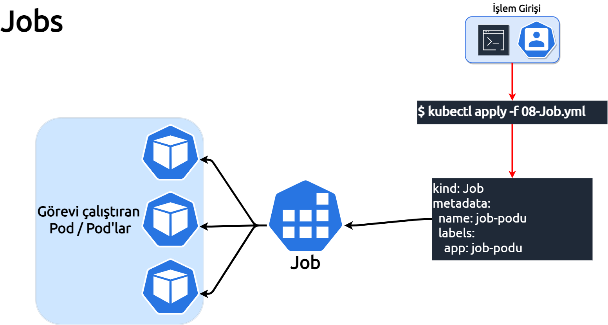

**Bu bölümde, Job'un birinci bölümünü işliyoruz.**

___

___

***Kubernetes jobs***, tek seferlik bir işi yerine getirmek için kullanılan görevlerdir, bu görevler bir pod oluşturularak yerine getirilir. 
Görevler, bir veya  daha fazla pod kullanılarak oluşturulabilir, pod görevi başarıyla sonuçlandırana kadar denemeye devam eder.
Görevi çalıştıran pod hatasız bir şekilde sonlandığında, görev başarılı bir şekilde tamamlanmış olur. 
Kubernetes görev'i silindiğinde ona bağlı podlarda birlikte imha edilir.

Kubernetes cluster'ının amacı uygulamaları çalıştırmak, yaşatmak gerektiğinde imha ederek yerini yenisi ile değiştirmek, güncellemek. 
Bu döngüyü sağlamak için podların yaşam varlıklarını kontrol eden replicaset veya deployment kullanıldığında, 
uygulamanın podu cluster içinde sürekli yaşam döngüsüne girmiş olarak hizmet vermeye başlar. Bu konsept ile, high availability (yüksek erişebilirlik) sağlanmış olur.

Job'larda durum böyle değildir, job'un görev durumuna göre, görev süresince çalışırlar, görev tamamlandığında çalışmayı durdururlar.

Bu bölümde, 
Bir görev oluşturacağız, görevin amacı  dört adet dns'in canlılık kontrolünü gerçekleştirmek olacak. 

Görev için <a href="./assets/08-Job.yml">**08-Job.yml**</a> belgesini kullanarak başlayacağız.

Kısaca yaml belgemize göz atalım:

```
apiVersion: batch/v1 
kind: Job			 
metadata:
  name: dns-kontrol	 
spec:
  template:
    spec:
      containers:
      - name: dns-kontrol			      
        image: techakademi/fping:1	
        command: ["fping"]			
        args: ["-d","1.1.1.1","8.8.8.8","208.67.222.222","37.235.1.174"]  
      restartPolicy: Never 			
```

| Alan         | Açıklama                                                          |
|--------------|-------------------------------------------------------------------|
|apiVersion    | Kubernetes'in hangi apisini kullandığımızı belirtiyoruz.          |
|kind          | Bu tanımın türünün bir Job (görev) olduğunu belirtiyoruz.	       |
|metadata      | dns-kontrol ismini kullanacağımızı tanımlıyoruz.                  |
|dns-kontrol   | podlar çalışırken dns-kontrol adını kullanacaklarını tanımlıyoruz.|
|image         | uygulama için kullanacağımız imajın adını belirtiyoruz.           |
|command       | pod çalıştığında hangi komutu kullanacağını belirtiyoruz.         |
|args          | uygulamanın kullanacağı argümanları tanımlıyoruz.                 |
|restartPolicy | pod'un tekrar başlama politikasını tanımlıyoruz.                  |


İlk job'umuzu çalıştırmadan önce, mümkünse kullandığınız terminali yatay şeklinde ikiye bölmenizde cluster'da job'ları pod'ları oluşumlarını anlık gözlemleme olanağına sahip oluruz. Ekranlardan birinde, watch komutunu çalıştırarak kendimize bir gözlem terminali oluşturmuş olalım.

***Bu komut ile ikinci bir terminal açabilirsin.***
`Terminal Aç`{{execute T2}}

***Terminal'de çalışması için aşağıdaki komutu kullanalım.***
`watch kubectl get all -o wide`{{execute T2}}

***kubectl get all -o wide*** tüm cluster'da oluşan nesneleri getir anlamındadır.
Çalışma ortamımızın hazır olması ile birlikte ilk job'umuzu çalıştıralım.

***Bu komutun sonucunu Terminal 2'den gözlemleyebilirisin.***
`kubectl apply -f 08-Job.yml`{{execute T1}}


Job tanımımızda, görev adeti belirtmemiştik, bu nedenle tek görevi yerine getirdi ve tamamladı.

```
NAME                    COMPLETIONS   DURATION   AGE   CONTAINERS    IMAGES                SELECTOR
job.batch/dns-kontrol   1/1           3s         27s   dns-kontrol   techakademi/fping:1   controller-uid=625f9eea-23db-4eeb-b1d7-cf19971d5b01
```

Görev podunun logunu kontrol ederek görev sonucunu gözlemleyelim.
___
***kubectl get pods ile pod'un adını ve ID'sini öğrenip aşağıda ki komutta pod'un adını kullanalarak çalıştıralım.*** 
___


**Not: Kubernetes'de bir pod'un logunu görüntülemek için, pod ya çalışıyor olması veya görevini tamamlamış olması gerekir.**

--- 
`kubectl get pods`{{execute T1}}

**kubectl logs dns-kontrol-<Pod-ID>**

Görev'den beklentimiz, fping uygulaması ile IP'lerini belirttiğimiz DNS suncularının canlılıkk testini yapması idi, sonuca baktığımızdqa başarılı bir şekilde yerine getirdiğini görmüş oluyoruz.

```
dns.google is alive
one.one.one.one is alive
dns.opendns.com is alive
resolver1.freedns.zone.powered.by.virtexxa.com is alive
```

Bir sonra ki adıma geçmeden, job'un arka tarafta neler yaptığına bakalım:

`kubectl describe jobs.batch dns-kontrol | less`{{execute T1}}

***Çıkmak için önce ":" sonra da "q" tuşlarını kullanmanız yeterli olacaktır.***

```
Parallelism:      1                                   
Completions:      1                                   
Completion Mode:  NonIndexed                          
Start Time:       Sun, 09 Jan 2022 08:02:06 +0000
Completed At:     Sun, 09 Jan 2022 08:02:09 +0000
Duration:         3s
Pods Statuses:    0 Active / 1 Succeeded / 0 Failed
```

Bu tanımın içinden şimdilik görmek istediklerimiz, görevin başlama ve bitişini, toplam görev zamanını ile pod'un durumu hakkında bilgilerdir.

Job'un birinci bölümünü burada tamamladık, bir sonraki adıma geçebiliriz.
