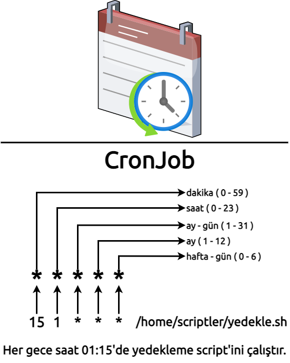
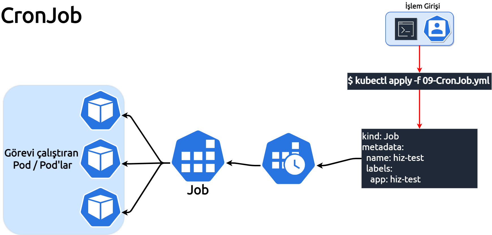

**Bu bölümde, CronJob'un birinci bölümünü işliyoruz.**
___

___
Cronjob, Linux işletim sistemlerinde kullanılan komut satırı programıdır, cronjob ile görev zamanlaması gerçekleştirilir.
 
Kubernetes'de ise Cronjob, job'ları yenilenen bir programatik haline getirmektir. Cronjob nesnesi, bir crontab (cron tablosu) dosyasının satırı gibidir.
Görevi veya görevleri, belirli bir porgrama göre periyodik olarak çalıştırır. CronJobs, yedekleme, raporlama, e-posta gönderme vb. gibi düzenli zamanlanmış eylemleri yerine getirmek için kullanılmaktadır. 
Herbir CronJob, günde bir kez tekrarlanacak şekilde yapılandırılmalıdır. Tüm CronJob zamanlamaları (schedule) kube-controller'in saat dilimine göre zamanlanırlar. 
CronJob cluster kapsamında nesne olduğundan, kullanılacak zaman dilimine kube-controller-manager karar veriyor. 

Cronjob ile ilgili daha detaylı bilgi sahibi olmak için : https://en.wikipedia.org/wiki/Cron sayfasını ziyaret etmenizi öneririm, ayrıca zamanlama oluşturmak için de, https://crontab.guru/ adresinden oluşturmanızda fayda olacaktır.
___


___

Kubernetes'de cronjob oluşturma çalışmamızda, sunucunun hız testini yapan bir uygulama kullanacağız, hız testini elle yapmak yerine belirli aralıklarla CronJob'a bağlayarak yapmak istiyoruz. 

Job ile Cronjob aynı API'yi kullanıyorlar, tür olarak job'larda job olarak belirtirken, cronjob'larda cronjob olarak belirtiyoruz. Spesifikasyon bölümüne ise, "schedule" alanı ekleyerek 
cronjob zamanlama formatının aynısını uyguluyoruz.

```
spec:
  schedule: "*/1 * * * *"
  jobTemplate:
```

CronJob [09-Cronjob.yml](./assets/09-CronJob.yml) belgesinde her dakikada bir çalışarak  görev oluşturacak şekilde yapılandırılımş haldedir. 

***Bu komutun sonucunu Terminal 2'den gözlemleyebilirisin.***
`kubectl apply -f 09-CronJob.yml`{{execute T1}}

```
cronjob.batch/hiz-test created
```
CronJob'u basit kılmak adına, her bir dakikada çalışacak şekilde zamanlamıştım, bu cronjob ile kube-controller her bir dakikada hız testini yapacak yeni bir bir görev çalıştıracaktır.


```
NAME                     SCHEDULE    SUSPEND   ACTIVE   LAST SCHEDULE   AGE   CONTAINERS   IMAGES                  SELECTOR
cronjob.batch/hiz-test   */1 * * * *   False     0        <none>          8s    hiz-test     techakademi/hiztest:1   <none>
```

```
NAME                          READY   STATUS    RESTARTS   AGE   IP             NODE          NOMINATED NODE   READINESS GATES
pod/hiz-test-27363254-p5mtl   1/1     Running   0          9s    172.16.90.10   kubeworker1   <none>           <none>
```

Hız testinin sonucunu pod'un log'una bakarak görebiliriz.

```
kubectl logs hiz-test-<Pod-ID>
```

```
Ping: 10.819 ms
Download: 259.19 Mbit/s
Upload: 133.22 Mbit/s
```

CronJob'un birinci bölümünü burada tamamladık, bir sonraki adıma geçebiliriz.