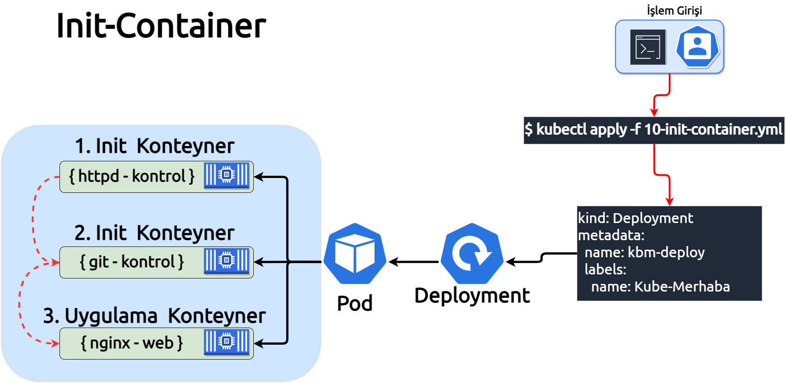
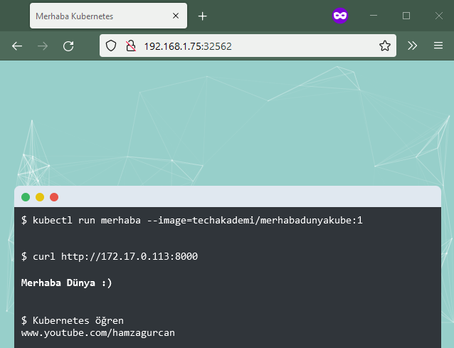

**Bu bölümde, Init Container bölümünü işliyoruz.**

___

___

***Init Container***, Bir pod içinde çalışacak olan uygulama konteyner'inden önce çalışan özel konteynerdir. Init, initialize kelimesinin kısaltılmış hali olup başlatmak anlamına gelmekte, ancak tam olarak karşılığı bu değildir. Tam olarak kastedilen, hazırlamaktır ya da ön hazırlık yapmaktır, örneğin bir işin başlaması için ondan önce yapılması gerekenler gibi, yada yemek için sofranın hazırlanmasını düşünebiliriz, yemekte çorba var ise, sofrada çorbayı koyacak kase ile kaşığın hazır olması gerektiği gibi, Initialize'ın ***init'i*** bu anlamda kullanılmaktadır.

Kubernetes'de Init Container ise, uygulama imajında olmayıp ancak çalışması için ihtiyacı olan yardımcı programlar, scriptler, kurulum dosyaları gibi nesneleri init container ile çalıştırıp asıl uygulamanın çalışması sağlanmaktadır.

Örneğin, veritabanı sunucusunu ele alalım. Çalışacak uygulamanın tablosuna hazır olan veriyi  yüklemek istiyoruz, ancak bu işlemi veritabanı konteyneri çalışmadan gerçekleştirecek olalım, hatta veritabanı dosyasının'da başka bir noktada hazır olduğunu varsayalım. Init container kullanmadan normal şartlar altında şöyle yapılırdı :

1. Veritabanı dosyası ortak bir noktaya download edilirdi.
2. Vertiabanı sunucununa dosya ortak noktadan içine alınarak işlem tamamalanırdı.

Init Container, bu ve bu türev amaçlarda kullanılmak üzere var olan bir konteyner türüdür.

Init Container'leri listenin dışında ki konular haricinde normal konteynerlerden farkları yoktur:

* Init Container'leri istenilen yada yerine getirilmesi beklenen işlem tamamlanana kadar çalışır.

* Init Container'leri sırasıyla çalışırlar, bir önceki container görevini tamamlamadan diğeri işleme başlamaz.

Eğer, Init Container'lerinden herhangi bir nedenden dolayı, görevini tamamlamaz ise ***kubectl*** o container'i başarılı olana kadar çalıştırcaktır. Bu kubectl'ın ilgili container'i tekrar tekrar yeniden başlatacağı anlamına gelmektedir.

Ancak, Pod'un tanımında ***"restartPolicy: Never"*** pod'u hiç bir zaman yeniden başlatma politikası tanımlanmış ise, Init Container başarısız olduğunda Kubernetes pod'u genel olarak başarısız olduğunu  değerlendirip pod'u durdurur.

Bu bölüm için dört farklı container'dan oluşan bir deployment hazırladım, deployment senaryosunu şöyle tasarladım:

1. Busybox linux'ın httpd sunucusunu kontrol eden **"init1"** adında bir container'imiz var.

2. Github'da  **"Merhaba Kube"** adındaki projemizi kontrol eden, **"init2"** adında başka bir container'imiz var.

3. **Merhaba Kube** projesini nginx'de çalıştıracak şekilde klonlayan alpine/git adında başka bir contianer'imiz var.

4. Klonlanan sitenin çalışması için de nginx container'imiz var.

Siteyi klonlayan konteyner ile siteyi yayınlayacak olan nginx'in ortak kullancakları bir adet veribirimine ihtiyacımız olacak. Veribirimi olarak ***emptyDir*** kullanacağız.

Deployment'imizi çalıştırmadan önce, mümkünse kullandığınız terminali yatay şeklinde ikiye bölmenizde veya başka bir terminal açarak anlık gözlemleme olanağına sahip olursunuz.
Ekranlardan birinde, watch komutunu çalıştırarak kendimize bir gözlem terminali oluşturmuş olalım.

***Bu komut ile ikinci bir terminal açabilirsin.***
`Terminal Aç`{{execute T2}}

***Terminal'de çalışması için aşağıdaki komutu kullanalım.***
`watch kubectl get all -o wide`{{execute T2}}

***kubectl get all -o wide*** tüm cluster'da oluşan nesneleri getir anlamındadır.
Çalışma ortamımızın hazır olması ile birlikte deployment'imizi çalıştıralım.

Init Container deployment [10-init-container.yml](./assets/10-init-container.yml) belgesinde sırasıyla container'leri çalıştıracak şekilde yapılandırılımş haldedir.

***Bu komutun sonucunu Terminal 2'den gözlemleyebilirisin.***
`kubectl apply -f 10-init-container.yml`{{execute T1}}

##### 1.Container ***httpd-kontrol*** çalışıyor
```
NAME                             READY   STATUS     
pod/kbm-deploy-b8f4f8b68-ttrjb   0/1     Init:0/3   
```

##### 2.Container ***git-kontrol*** çalışıyor
```
NAME                             READY   STATUS      
pod/kbm-deploy-b8f4f8b68-ttrjb   0/1     Init:1/3            
```

##### 3.Container ***clone-repo*** çalışıyor
```
NAME                             READY   STATUS           
pod/kbm-deploy-b8f4f8b68-ttrjb   0/1     Init:2/3   
```

##### Tüm konteynerler sorunsuz işlemlerini tamamlayınca, ***nginx*** hazılranmaya başladı, (imaj download aşaması)
```
NAME                             READY   STATUS            
pod/kbm-deploy-b8f4f8b68-ttrjb   0/1     PodInitializing   
```

##### İmaj download tamamlanınca, ***nginx*** çalışmaya başladı
```
NAME                             READY   STATUS    
pod/kbm-deploy-b8f4f8b68-ttrjb   1/1     Running   
```

Sitenin dış dünyaya erişime açılması için cluster'in NodePort'unu expose etmemiz gerekecek, yayına açmadan önce, init container'leirmizin loglarına bir göz atalım.

Httpd-kontrol ile başlayalım, **"-c"** operatör'ü container adını belirtmek için kullanılıyor.


***Logları okumak için bu platformda çalışan podları listelemeyi unutma***

```
kubectl logs kbm-deploy-b8f4f8b68-ttrjb -c httpd-kontrol
```
Busybox'da varsaylıan olarak httpd sunucusu kapalı bir şekilde, geliyor.
Hazırladığım script'i Github'da inceleyebilirsin [init-container1-imaj](https://github.com/techakademi/KubernetesDersler/tree/master/07-Init-container/init-Container1-imaj) Script önce kontrol yapıyor, sonra çalışmadığını tespit edince sunucuyu başlatıp sonucunu bildiriyor.

```
--------------------------------------
    Merhaba, ben Init Droid v1 :)     
--------------------------------------
httpd Kontrolüne başladım.
--------------------------------------
Üzgünüm, httpd servisi çalışmıyor.
--------------------------------------
httpd Servisini başlatıyorum.
--------------------------------------
httpd Servisi başlattım, şu an çalışıyor.
**************************************
         Kontrol tamamlandı.          
**************************************
```

Diğer container loguna'da bakalım:

```
kubectl logs kbm-deploy-b8f4f8b68-ttrjb -c git-kontrol
```
Bu container ise, script'de belirlediğim git reposunu kontrol ediyor, repo var ise kontrol geçiyor yok değilse olmadığını bildiriyor.
Hazırladığım script'i Github'da inceleyebilirsin [init-container2-imaj](https://github.com/techakademi/KubernetesDersler/tree/master/07-Init-container/init-Container2-imaj).
```
--------------------------------------
     Merhaba, ben Init Droid v2 :)     
--------------------------------------
Merhaba_Kubernetes Repo Kontrolüne başladım.
--------------------------------------
Tebrikler, Merhaba_Kubernetes Repo mevcut.
**************************************
         Kontrol tamamlandı.          
**************************************
```
Her iki container'in loglarından gayet açık bir şekilde başarılı oldukları anlaşılıyor.

Uygulamayı dış dünyaya açmak için bir servis oluşturalım.

***Bu komutun sonucunu Terminal 2'den gözlemleyerek, Port numarasını görebilirsin.***

`kubectl expose deployment kbm-deploy --type NodePort --port 80`{{execute T1}}

```
NAME                 TYPE        CLUSTER-IP      EXTERNAL-IP   PORT(S)        AGE   SELECTOR
service/kbm-deploy   NodePort    10.97.184.127   <none>        80:32562/TCP   9s    name=Kube-Merhaba
```

Kubernetes uygulamayı **"PORT sütununda belirtilen"** nolu port üzerinden erişilebilir hale getirdi.

---
##### Aşağıdaki link üzerinden Merhaba Dunya uygulamasına erişebilrisin.:

##### Servisin port numarasını resimde ki alana yazmayı unutma.


https://[[HOST_SUBDOMAIN]]-80-[[KATACODA_HOST]].environments.katacoda.com
---



Tebrikler, başarılı bir şekilde Init Caontainer çalışmasını tamamladın.

Deployment'i silmek için:
`kubectl delete -f 10-init-container.yml`{{execute T1}}

Silme işlemini teyit eden mesaj görünecektir.
```
deployment.apps "kbm-deploy" deleted
```

Service'i silmek için:
`kubectl delete service kbm-deploy`{{execute T1}}


Aynı şekilde silme işlemini teyit eden mesaj belirecektir.
```
service "kbm-deploy" deleted
```
___
Init Container bölümümüzü burada tamamlamış olduk arkadaşlar, umarım faydalı olmuştur. Bir diğer bölümde görüşmek üzere hoşçakalın.
