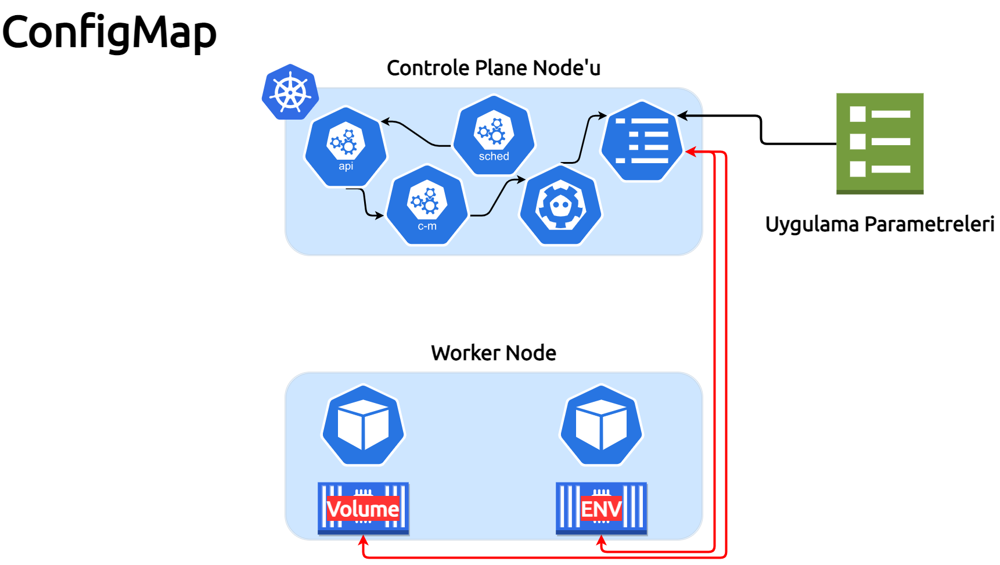

# Bu bölümde, ConfigMaps konusunu işleyeceğiz

___


___

ConfigMap, gizli olmayan verileri anahtar/değer çiftlerinde depolamak için kullanılan bir API nesnesidir. Pod'lar, ConfigMaps'i ortam değişkenleri, komut satırı değişkenleri veya bir veribirimi yapılandırma dosyaları olarak kullanabilirler.

Uygulamalar özellikle geliştirme aşamalarında sıklıkla yapılandırma değişimine ihtiyaç duyarlar, yapılandırma parametrelerini uygulamanın içine kodlamak, her değişimde uygulama imajının tekrar hazırlanmasını gerektirecektir. Yenilenen imajın tüm ekip tarafından tekrar kullanılmasını sağlamak, imajı ilgili registry'ye push etmek gibi bir çok sürecin işlemesini gerektiren zaman ve kaynak israfı anlamına gelmektedir.

Bu şekilde yürütmek yerine, uygulamanın yapılandırma parametrelerini dışarıda barındırarak, her seferinde sadece ilgili uygulama imajını gerekli yeni hali ile yayınalamaya odaklanmak daha doğru olur.

Konfigurasyon nedir?, bir uygulamanın çalışmaya başlaması ve devam edebilmesi için ihtiyaç duyduğu herşey.

Örneklemek gerekirse:

* Veritabanı bağlantı stringleri
* Kullanıcı adı parolalar
* Port numaraları
* Servis adları
* Servis adresleri

şeklinde sıralayabilriz.

Bu yapılandırma parametreleri hassas veri ile hassas olmayan veri olarak ikiye ayırabiliriz, parola, anahtar, API anahtarı gibi hassas verileri içeren parametreleri bir önceki bölümde işlediğimiz gibi **"Secret"** kullanarak uygulama içerisine alınmalı.Bunun haricinde bağlantı portları, bağlantı adresleri gibi hassas ver içermeyen parametreler için **"ConfigMaps"** kullanabiliriz.

| ⚠ Dikkat: ConfigMap gizlilik veya şifreleme sağlamaz. Saklamak istediğiniz veriler gizliyse, ConfigMap yerine bir Secret kullanın veya verilerinizi gizli tutmak için ek (üçüncü taraf) araçlar kullanın. ⚠|
| --- |  

Herhangi bir ConfigMap'ı Pod ile kullanımı dört şekilde olmakta:

1. Bir konteyner içinde komut argümanı
2. Konteyner ortam değişkeni
3. Veribiriminde salt-okunur bir belge
4. Kubernetes API üzerinden bir ConfigMap'ı okuayabilecek Pod içinde çalışan uygulama ile gerçekleştirilebilir.

ConfigMap'lerimizi oluşturmadan önce, mümkünse kullandığınız terminali yatay şeklinde ikiye bölerek anlık gözlemleme olanağına sahip oluruz.
Ekranlardan birinde, watch komutunu çalıştırarak kendimize bir gözlem terminali oluşturmuş olalım.

```bash
watch kubectl get cm,pods
```

***kubectl get cm,pods*** tüm cluster'da oluşan pod ve secret nesnelerini getir anlamındadır.

Sırası ile ConfigMap üretip kullanalım:

## 1.Senaryo

Bu uygulamada, **"kubcetl create configmap"** komut aracı ile bir ortam değişkeni olarak kullanılacak şekilde ConfigMap oluşturalım.

1. Adım Kullanıcı adı parola barındıran bir secret oluşturalım:

`kubectl create configmap merhaba-map --from-literal=selam=merhaba-Kubernetes-Dunyasi`{{execute}}

SecrConfigMap'in oluşturulduğunu teyit eden komut aşağıda ki gibi olacaktır:

```bash
configmap/merhaba-map created
```

2.Adım, secretin içeriğini inceleyelim:

`kubectl describe configmap merhaba-map`{{execute}}

```bash
Name:         merhaba-map
Namespace:    default
Labels:       <none>
Annotations:  <none>

Data
====
selam:
----
merhaba-Kubernetes-Dunyasi

BinaryData
====

Events:  <none>
```

3.Adım, oluşturduğumuz bu ConfigMap değerini ortam değişkeni halinde kullanabileceğimiz bir pod oluşturalım.

ConfigMap Pod oluşturmak için  [25-Conf-Merhaba-Map.yml](./assets/25-Conf-Merhaba-Map.yml) belgesinde konteynerin ortam değişkeni olarak kullanacağı değerleri içeren manifest hazır durumdadır.

`kubectl apply -f 25-Conf-Merhaba-Map.yml`{{execute}}

```bash
pod/merhabamap-env-pod created
```

Pod'un ortam değişkenlerini okumak için interaktif shell ile konteynere erişip değerleri görelim.

`kubectl exec -it merhabamap-env-pod -- sh`{{execute}}

```bash
/ #
```

Konteyner arayüzünde bulunduğumuz sırada **echo** ile ortam değişkeni olarak tanımladığımız **selam** değişkeninin değerini görüntüleyelim.

`echo $selam`{{execute}}

```bash
merhaba-Kubernetes-Dunyasi
/ #
```

merhaba-map ConfigMap'ında oluşturduğumuz selam değişkeninin değeri olan ***"merhaba-Kubernetes-Dunyasi"*** konteynerimiz tarafından okunarak aktarımı bu şekilde gerçekleşmiş oldu.

ConfigMap'i ortam değişkeni olarak kullandığımızda, ilgili değişken konteynerin oluşum anında ortam değişkeni olarak kayıt edilir.Değişken değerinin yenisi ile değişmesi halinde Pod'un güncellenen değişkeni tekrar alabilmesini tek yolu restart edilerek yeni değeri almasından geçer.

Uygulama parametrelerinin sıklıkla değiştiği durumlarda, env olarak kullanmak yerine, veribirimi (volume) şeklinde kullanarak pod'a monte etmek daha iyi olacaktır.

## 2.Senaryo

ConfigMap'lar, Çalışan uygulamanın komut argümanı şeklinde kullanılabildiği şeklini uygulayacağız bu bölümde, DNS sunucu kontrolünü yapan uygulamamız sunucu ip'lerini Pod'un spec'ine tanımlayarak kullanmıştık ***"Jobs_Cronjobs"*** bölümünde. Bu senaryoda, yine aynı uygulama için ip adresini bir ortam değişkeni şeklinde yeni bir ortam değişkeni oluşturup tanımlayarak kullanacağız.
Ancak bu sefer ConfigMap'ımızı kubectl komutu yerine bir manifest ile oluşturacağız, uygulayacağımız adımlar aşağıda ki gibi olacaktır:

1.Adım, Uygulama değişkenimizi içeren parametreleri barındıran manifest'imizi oluşturalım.

`sudo nano 26-1-Dns-Config.yml`{{execute}}

### Manifestimiz aşağıdaki gibi olmalı

```yaml
apiVersion: v1
kind: ConfigMap
metadata:
  name: dns-map
  namespace: default
data:
  dns1: 1.1.1.1
  dns2: 8.8.8.8
```

2.Adım, ConfigMap'ımızı oluşturalım:

`kubectl apply -f 26-1-Dns-Config.yml`{{execute}}

```bash
configmap/dns-map created
```

ConfigMap'ı kullanacak Pod oluşturmak için  [26-Conf-Dns-Env.yml](./assets/26-Conf-Dns-Env.yml) belgesinde konteynerin ilgili değişekneleri okuyacak şekilde değerleri içeren manifest hazır durumdadır.

3.Adım, Dns kontrolünü gerçekleştirecek Podumuzu çalıştıralım.

`kubectl apply -f 26-Conf-Dns-Env.yml`{{execute}}

```bash
pod/dns-kontrol-conf created
```

4.Adım, dns-kontrol-conf Pdo'umuzun loglarını kontrol ederek sonucunu öğrenelim.

`kubectl logs dns-kontrol-conf`{{execute}}

```bash
dns.google is alive
one.one.one.one is alive
```

ConfigMap'de tanımladığımız ip adreslerinin kontrollerini başarılı bir şekilde yerine getirmiş olduğunu görebilmekteyiz.

## 3.Senaryo

Dns kontrolünü gerçekleştiren uygulamamız başarılı bir şekilde çalışıyor, ancak yazılımıza yen bir ip eklemek istediğimizde, sırasıyla önce configMap'ı sonra da Pod'un spec'ine yeni bir satır ekleyip sonrasında ise Pod'u tekrar çalıştırmamız gerekecek. Bu uygulanabilecek bir yöntem olmakla birlikte, kullanacağımız parametrelerin değişmesi halinde uygulamaya yansımasını ve yeni parametreleri kullanarak çalışmasını sağlayabiliriz.

Bu bölüm için hazırlamış olduğum **"techakademi/pinger:1"** adında bir uygulamam var, uygulama bir öneki sürümde olduğu gibi DNS kontrolünü gerçekleştiriyor, aslında özellikle DNS değil herhangi bir ip adresini pingleme işlemini gerçekleştiriyor, ancak bir fark var ki pingleyeceği ip adreslerini ***"/pinger/adres.cfg"*** klasörü altında bulunan adres.cfg belgesinden okuyarak ipleri pingliyior.

Pinger uygulamasının çalışması için ihtiyacı olan parametreleri, bir veribirimi kullanarak ekleyeceğiz, böylece konteyner çalıştığında ***adres.cfg*** belgesinde var olan ip adreslerini ***/pinger*** klasörüne montelemiş olacağımızdan ip'leri pingleme işlemini yerine getirebilecektir.

1.Adım, Uygulama değişkenimizi içeren parametreleri barındıran manifest'imizi oluşturalım.

`sudo nano 27-1-Pinger-Config.yml`{{execute}}

### İlk manifestimiz aşağıdaki gibi olmalı

```yaml
apiVersion: v1
kind: ConfigMap
metadata:
  name: adres-map
  namespace: default
data:
  adres.cfg: |
      1.0.0.1
      8.8.4.4
```

2.Adım, ConfigMap'ımızı oluşturalım:

`kubectl apply -f 26-1-Dns-Config.yml`{{execute}}

```bash
configmap/adres-map created
```

ConfigMap'ı kullanacak Pod oluşturmak için  [27-Pinger-Conf_Vol.yml](./assets/27-Pinger-Conf_Vol.yml) belgesinde konteynerin ilgili değişekneleri okuyacak şekilde değerleri içeren manifest hazır durumdadır.

3.Adım, Dns kontrolünü gerçekleştirecek Podumuzu çalıştıralım.

`kubectl apply -f 27-Pinger-Conf-Vol.yml`{{execute}}

```bash
pod/adres-test-pod created
```

4.Adım, adres-test-pod Pdo'umuzun loglarını kontrol ederek sonucunu öğrenelim.

`kubectl logs adres-test-pod`{{execute}}

```bash
one.one.one.one is alive
Pinglenen IP 1.0.0.1 : Durumu Basarili
dns.google is alive
Pinglenen IP 8.8.4.4 : Durumu Basarili
```

Sonuç beklendiği gibi başarılı, ancak diyelim ki pinglemek istediğimiz adresleri güncellemek veya yenilerini eklemek istediğimizde ne yaparız?.

5.Adım, IP adreslerini içeren ConfigMap'ımıza yenilerini ekleyip güncelleyelim. Adres güncellemesi için aynı manfiestimizi kullanacağız, başka bir isimle kullanacak olursak bu yeni bir ConfigMap olacaktır.

`sudo nano 27-1-Pinger-Config.yml`{{execute}}

### Manifestimiz aşağıdaki gibi değiştirip kayıt edelim

```yaml
apiVersion: v1
kind: ConfigMap
metadata:
  name: adres-map
  namespace: default
data:
  adres.cfg: |
      1.0.0.1
      8.8.4.4
      9.9.9.9
```

6.Adım, ConfigMap'ımızı güncelleyelim.
`kubectl apply -f 27-1-Pinger-Config.yml`{{execute}}

```bash
configmap/adres-map configured
```

7.Adım, daha önce çalıştırdığımız Pod'umuz halen mevcut olduğundan onu imha ederek yeniden oluşturalım.

`kubectl delete pod adres-test-pod`{{execute}}

```bash
pod/adres-test-pod deleted
```

8.Adım, Podumuzu tekrar oluşturalım.

`kubectl apply -f 27-Pinger-Conf-Vol.yml`{{execute}}

```bash
pod/adres-test-pod created
```

9.Adım, Podumuzun log'unu kontrol ederek sonucunu görelim.

`kubectl logs adres-test-pod`{{execute}}

```bash
one.one.one.one is alive
Pinglenen IP 1.0.0.1 : Durumu Basarili
dns.google is alive
Pinglenen IP 8.8.4.4 : Durumu Basarili
dns9.quad9.net is alive
Pinglenen IP 9.9.9.9 : Durumu Basarili
```

Uygulama parametrelerini ConfigMap'i veribirimi olaraka kullandığımızda, parametre değişiklikleri uygulama içine dışarıdan enjekte edilerek yerine bu yöntem ile uygulanabilir.

## 4.Senaryo

Dns kontrolünü gerçekleştiren uygulamamız başarılı bir şekilde çalışıyor, ancak yazılımıza yen bir ip eklemek istediğimizde, sırasıyla önce configMap'ı sonra da Pod'un spec'ine yeni bir satır ekleyip sonrasında ise Pod'u tekrar çalıştırmamız gerekecek. Bu uygulanabilecek bir yöntem olmakla birlikte, kullanacağımız parametrelerin değişmesi halinde uygulamaya yansımasını ve yeni parametreleri kullanarak çalışmasını sağlayabiliriz.

Bu bölüm için hazırlamış olduğum **"techakademi/pinger:1"** adında bir uygulamam var, uygulama bir öneki sürümde olduğu gibi DNS kontrolünü gerçekleştiriyor, aslında özellikle DNS değil herhangi bir ip adresini pingleme işlemini gerçekleştiriyor, ancak bir fark var ki pingleyeceği ip adreslerini ***"/pinger/adres.cfg"*** klasörü altında bulunan adres.cfg belgesinden okuyarak ipleri pingliyior.

Pinger uygulamasının çalışması için ihtiyacı olan parametreleri, bir veribirimi kullanarak ekleyeceğiz, böylece konteyner çalıştığında ***adres.cfg*** belgesinde var olan ip adreslerini ***/pinger*** klasörüne montelemiş olacağımızdan ip'leri pingleme işlemini yerine getirebilecektir.

1.Adım, Uygulama değişkenimizi içeren parametreleri barındıran manifest'imizi oluşturalım.

`sudo nano asres.cfg`{{execute}}

### Aşağıdaki IP adreslerini ekleyip kayıt edip kapatalım

```cfg
208.67.222.222
185.228.168.9
76.76.19.19
94.140.14.14
```

2.Adım, ConfigMap'ımızı oluşturalım:

`kubectl create configmap adres-map-belge --from-file=./adres.cfg`{{execute}}

```bash
configmap/adres-map-belge created
```

ConfigMap'ı kullanacak Pod oluşturmak için  [28-Pinger-Conf-Vol-Belge.yml](./assets/28-Pinger-Conf-Vol-Belge.yml) belgesinde konteynerin ilgili değişekneleri okuyacak şekilde değerleri içeren manifest hazır durumdadır.

3.Adım, Dns kontrolünü gerçekleştirecek Podumuzu çalıştıralım.

`kubectl apply -f 28-Pinger-Conf-Vol-Belge.yml`{{execute}}

```bash
pod/adres-test-pod created
```

4.Adım, adres-test-pod-belge Pdo'umuzun arayüzüne erişelim.

`kubectl exec -it adres-test-pod-belge -- sh`{{execute}}

```bash
/ #
```

5.Adım, home dizininin altında bulunan pinger.sh scriptimizi çalıştıralım.

`./home/pinger.sh`{{execute T1}}

```bash
dns.umbrella.com is alive
Pinglenen IP 208.67.222.222 : Durumu Basarili
customfilter9-dns.cleanbrowsing.org is alive
Pinglenen IP 185.228.168.9 : Durumu Basarili
dns.alternate-dns.com is alive
Pinglenen IP 76.76.19.19 : Durumu Basarili
dns.adguard.com is alive
Pinglenen IP 94.140.14.14 : Durumu Basarili
```

Arayüzden çıkıp, ConfigMap'ımızı silelim, adres.cfg belgemize yeni IP adresi ekleyip configMap'ımızı tekrar oluşturup uygulamayı çalıştıralım.

1.Adım, Çıkış yapalım.
`exit`{{execute T1}}

2.Adım, adres-map-belge isimli ConfigMap'ımızı silelim.

`kubectl delete configmap adres-map-belge`{{execute T1}}

2.Adım, adres-map-belge isimli ConfigMap'ımızı silelim.

`kubectl delete configmap adres-map-belge`{{execute T1}}

```bash
configmap "adres-map-belge" deleted
```

3.Adım, adres.cfg belgemizi editleyip yeni IP adresi eklyelim.

`sudo nano asres.cfg`{{execute}}

### Aşağıdaki yeni IP adreslerini ekleyip kayıt edip kapatalım

```cfg
208.67.222.222
185.228.168.9
76.76.19.19
94.140.14.14
8.8.8.8
9.9.9.9
1.1.1.1
94.140.15.15
76.223.122.150

```

4.Adım, adres-map-belge ConfigMap'ımızı tekrar oluşturalım.

`kubectl create configmap adres-map-belge --from-file=./adres.cfg`{{execute}}

5.Adım, adres-test-pod-belge Pod'umuzun arayüzüne erişip scriptimizi tekrar çalıştıralım.

** Kubelet senkronizasyon süresi varsayılan olarak 1 dakikadır, bu süreden önce ConfigMap'ın yeni değerleri yansımaya bilir.**

5.1
`kubectl exec -it adres-test-pod-belge -- sh`{{execute}}

5.2
`./home/pinger.sh`{{execute T1}}

Sonuç:

```bash
dns.umbrella.com is alive
Pinglenen IP 208.67.222.222 : Durumu Basarili
customfilter9-dns.cleanbrowsing.org is alive
Pinglenen IP 185.228.168.9 : Durumu Basarili
dns.alternate-dns.com is alive
Pinglenen IP 76.76.19.19 : Durumu Basarili
dns.adguard.com is alive
Pinglenen IP 94.140.14.14 : Durumu Basarili
dns.google is alive
Pinglenen IP 8.8.8.8 : Durumu Basarili
dns9.quad9.net is alive
Pinglenen IP 9.9.9.9 : Durumu Basarili
one.one.one.one is alive
Pinglenen IP 1.1.1.1 : Durumu Basarili
dns.adguard.com is alive
Pinglenen IP 94.140.15.15 : Durumu Basarili
76.223.122.150 is alive
Pinglenen IP 76.223.122.150 : Durumu Basarili
```

Uygulamamız yeni parametreleri kullanarak eklenen IP adreslerini başarılı bir şekilde tamamını pinglemeyi başardı.

Pod'umuzdan çıkış yapalım.
`exit`{{execute T1}}

`kubectl delete pod adres-test-pod-belge`{{execute T1}}
pod "adres-test-pod-belge" deleted

`kubectl delete configmaps merhaba-map`{{execute T1}}
configmap "merhaba-map" deleted

`kubectl delete configmaps dns-map`{{execute T1}}
configmap "dns-map" deleted

`kubectl delete configmaps adres-map-belge`{{execute T1}}
configmap "adres-map-belge" deleted

`kubectl delete configmaps adres-map`{{execute T1}}
configmap "adres-map" deleted

Kubernetes'de secret kullanımı temel olarak bu yöntemler ile gerçekleştirilmektedir.Bu bölümüde burada tamamalamış olduk arkadaşlar, bir sonra ki bölümde görüşmek üzere hoşçakalın.

___

### Bu Bölümün Menüsüne çık [12-ConfigMap'a Geri Dön](https://github.com/techakademi/KubernetesDersler/tree/master/12-ConfigMap)

## Ana Bölüm [Kubernetes Derlser'e geri dön](https://github.com/techakademi/KubernetesDersler)

**Referanslar:**

**[ConfigMap](https://kubernetes.io/docs/tasks/configure-pod-container/configure-pod-configmap/)**

**[Environment Variable](https://en.wikipedia.org/wiki/Environment_variable)**
