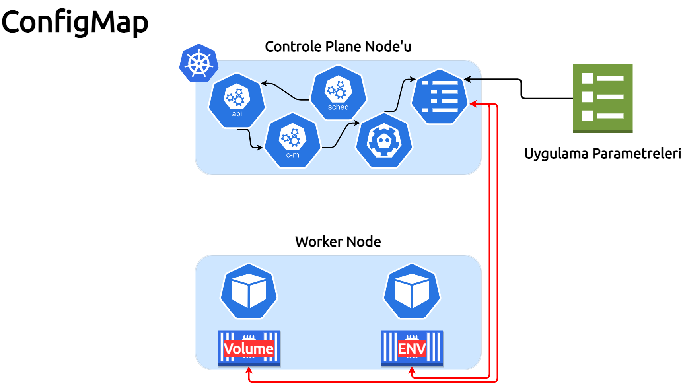

##### Bu bölümde, ConfigMaps konusunu işliyoruz.

___

___

ConfigMap, gizli olmayan verileri anahtar/değer çiftlerinde depolamak için kullanılan bir API nesnesidir. Pod'lar, ConfigMaps'i ortam değişkenleri, komut satırı değişkenleri veya bir veribirimi yapılandırma dosyaları olarak kullanabilirler.

İyi dersler arkadaşlar :)

theadmin.
