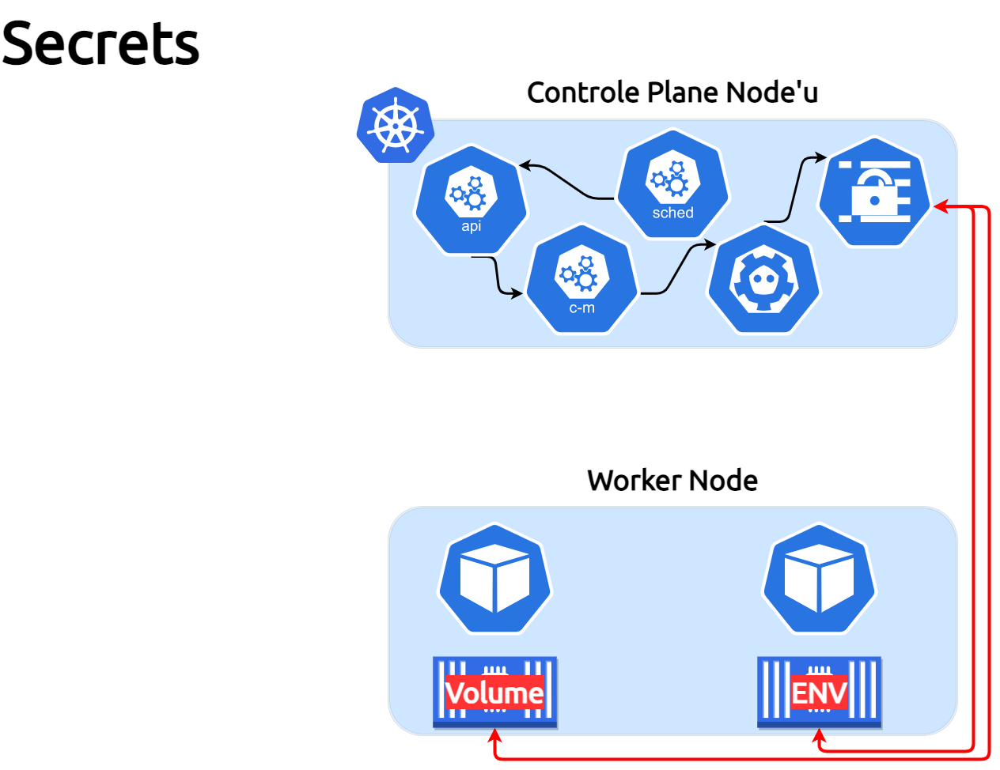

##### Bu bölümde, Secrets konusunu işliyoruz.

___

___

Secret, bir parola, token veya anahtardan oluşan hasass veri içeren bir nesnedir. Bu tür hassas nesneler bir pod'un spesifikasyonuna veya konteyner imajı içerisine eklenmiş bir halde kullanılır. Kubernetes'de hasass veri içeren bu tür nesnelerin uygulama kodu veya pod'un spec'ine ekleme ihtiyacı olmadan **"Secret"** kullanarak uygulamaları çalıştırabileceğimiz anlamına gelmekte.

İyi dersler arkadaşlar :)

theadmin.
