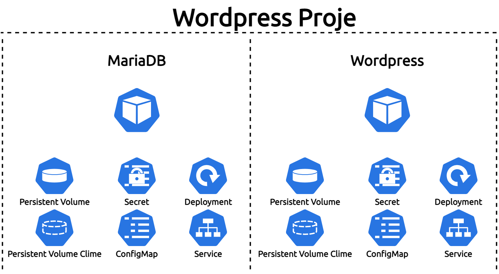

##### Bu bölümde, Wordpress & MySQL Uygulama projesi.

___

___

Wordpress, PHP dilinde yazılmış MySQL veya MariaDB veritabanlarını kullanabilen ücretsiz open source (CMS)içerik yönetim yazılımıdır.Wordpress başlangıçta, kişisel blog oluşturma yazılımı olarak geliştirilmiş ancak zaman içinde web, forum, satış, üyelik gibi siteleri oluşturmanın mümkün oladuğu bir yazılıma dönüşmüştür. Wordpress şu an on milyonun üzerinde web sitesi tarafından kullanılmaktadır.

İyi dersler arkadaşlar :)

theadmin.
