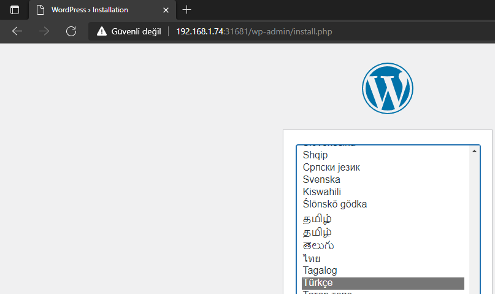
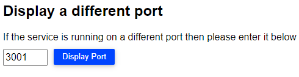

## Wordpress Uygulama adımları

1.Adım Wordpress'in ihtiyaç duyduğu ortam değişkenlerini configmap olarak tanımlayalım.

## 1. Adım, Aşğıdaki manifesti kopyalayıp nano editörüne Shift+Insert kullanarak yapıştıralım

### 2. Adım, ctrl+o ile belgeyi kayıt edelim

#### 3. Adım, ctrl+x tuşları ile nano'dan çıkalım

`sudo nano 06-Wordpress-Configmap.yml`{{execute T1}}

```yaml
apiVersion: v1
kind: ConfigMap
metadata:
  name: wordpress-config
data:
  mysql.db.host: mysql-service
  mysql.db.name: kubeblog
  mysql.db.prefix: kube_
```

1.2 Configmap'i kullanılmak üzere uygulayalım.

`kubectl apply -f 06-Wordpress-Configmap.yml`{{execute T1}}

```bash
configmap/wordpress created
```

1.3 Persistent Volume & Clime'ını oluşturmak

Wordpress'in kullanacağı veribirimi için [07-Wordpress-Pv-Pvc.yml](./assets/07-Wordpress-Pv-Pvc.yml) belgesinde veribirimi ile birlikte clime'ın birlikte kullanılabilecek şekilde manifestimiz hazır.

Veribirimini oluşturacak Manifestimizi çalıştıralım.

`kubectl apply -f 07-Wordpress-Pv-Pvc.yml`{{execute T1}}

```bash
persistentvolume/wp-pv created
persistentvolumeclaim/wp-pv-claim created
```

1.4 Wordpress Deploymentini yayınlama

Wordpress Deployment'i için [08-Wordpress-Deployment.yml](./assets/08-Wordpress-Deployment.yml) belgesinde kullanılabilecek şekilde manifestimiz hazır.

Wordpress Podumuzu oluşturacak Manifestimizi çalıştıralım.

`kubectl apply -f 08-Wordpress-Deployment.yml`{{execute T1}}

```bash
deployment.apps/wordpress created
```

1.5 Wordpress Servisini oluşturmak

Wordpress Servisini [09-Wordpress-Service.yml](./assets/09-Wordpress-Service.yml) belgesinde kullanılabilecek şekilde manifestimiz hazır.

Wordpress Servisimizi oluşturacak Manifestimizi çalıştıralım.

`kubectl apply -f 09-Wordpress-Service.yml`{{execute T1}}

```bash
service/wordpress created
```

Gözlem ekranımızdan Wordpress Servisine atanan port numarasını öğrenip tarayıcımız üzerinden Wordpress kurulum ekranına erişelim.



### Wordpress Kurulum ekranını aşağıdaki link  üzerinden gerçekleştirebiliriz.

**<https://[[HOST_SUBDOMAIN>]]-3001-[[KATACODA_HOST]].environments.katacoda.com**

Servisin port numarasını resimde ki alana yazarak uygulamaya erişebilirsiniz.



Bir sonraki bölüme geçerek Wordpress & MySQL yedekleme işlemlerimize başlayalım.
