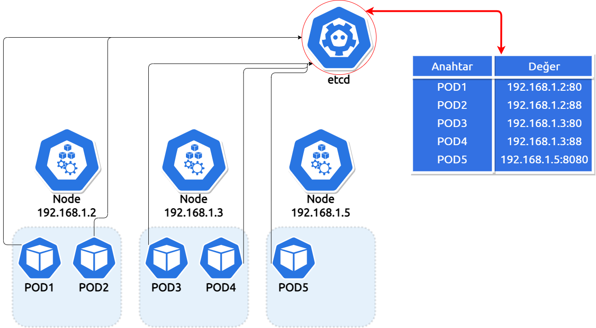

----------------------------------------------------------------------
#### Resimde'ki senaryo'da gosterilen anahtar degerleri olusturalim.
----------------------------------------------------------------------



Bu bölümde beklenen, etcd'ye 5 adet kayıt girmenizdir.

 **İpucu:**
 ```
 $ etcdctl set POD1 192.168.1.2:80
 ```
 ---
Kayıt işlemlerini tamamladığınızda, **etcdctl ls** komutu ile tüm kayıt anahtarlarını listeleyebilirsiniz.

---
***Dersin kontrolünü hazirlamis oldugum scripti kullanarak gerçekleştirebilirsiniz.***

---

Scripti çalıştırmak için:

`./etcd-kontrol.sh`{{execute}}

Scriptin kontrolü sonucunda ekranda aşağıdaki gibi kontrol sonucunu listeleyecektir.


**Bir sonraki ders [Kubernetes'e Giriş](https://www.katacoda.com/techakademi/scenarios/kubernetesgiris)**